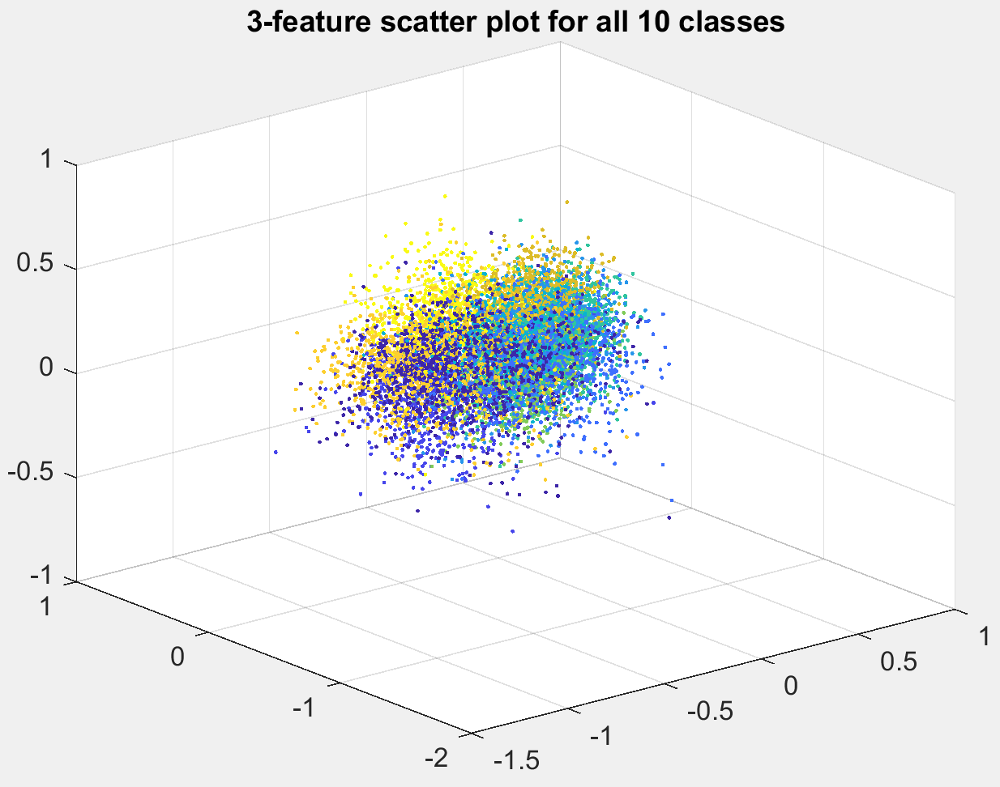

# Image Classification with Support Vector Machine

### Here I train Support Vector Machine, Linear Discriminant Analysis, and a four-layer feed forward neural net to classify 10 image categories from CIFAR-10 dataset achieving the highest accuracy with SVM at 62.7%. Key question of the experiment is to find if the non-traditional combination of PCA and LDA for dimensionality reduction outperforms LDA or PCA alone. In addition, I test if it is possible to use clustering methods (k-means and GMM) for classification, given supervised class centroid initialisation.

## Matlab Requirements:    
- FDA LDA multiclass (version 1.7)
- Computer Vision System Toolbox (version 8.0)
- Neural Network Toolbox (version 11.0)
- Statistics and Machine Learning Toolbox (version 11.2)

## How to Run    
Clone the repository on your machine and be sure CW2Data.mat is in the same folder as the matlab scripts. Run matlab steps 1 to 8 in that order.

## Introduction
We are presented with a ten-class supervised classification problem of CIFAR-10 dataset images. Our training and testing data consists of 1000 and 100 samples respectively for each of the ten classes. The image data is stored in four-dimensional matrices where the first two dimensions represent image size (32x32), third dimension is the RGB colour channel and the last dimension indexes the data samples. Our proposed data mining pipeline starts with feature extraction using Histogram of Oriented Gradients (HOG) and dimensionality reduction with PCA and LDA. We implement and test three dimensionality reduction strategies of PCA-only, LDA-only and PCA combined with LDA. We proceed to exploratory data analysis of our reduced feature space with group scatter plot matrices, histograms and probability density functions. Our classification stage implements k-means, GMM, LDA, SVM, and NN with each of the dimensionality reduction strategies. We enable the use of k-means and GMM clustering algorithms for our classification task by initialising class centroids close to the corresponding true values extracted from a supervised LDA model. The highest accuracy reached with each of the classification algorithms can be summarised as: NN (52.3%), GMM (58.0%), k-means (61.5%), LDA (61.5%) and SVM (62.7%).

## Feature extraction and dimensionality reduction    
We use the Histogram of Oriented Gradients (HOG) algorithm to compute 324 features for each image, then carry out dimensionality reduction in three different ways: Principal Component Analysis (PCA); Linear Discriminant Analysis (LDA) and a combination of PCA with LDA. Our rationale for choosing to keep 55 PCA features is based on the results of the five classification algorithms which perform best with this optimal value. The projected feature space of LDA is C-1 where C is the number of classes. Since we have 10 image categories our resultant training and testing data becomes reducible to between 1 and 9 dimensions where we choose to keep all 9. Within our experimental combination of PCA and LDA we pre-reduce our 324 features with PCA to 55, followed by further data reduction with LDA to 9 dimensions. Our rationale for combining PCA and LDA stems from the 2003 study by Yang J. & Yang J.Y. which states that using the two algorithms together has shown to increase accuracy of image classification and face detection making it a valid data reduction framework. We save the reduced data from each of those three methods and compare performance of our classifers against each data reduction strategy.

## Exploratory Data Analysis    
The goal of our EDA is to visualise and explore class separability of reduced PCA+LDA feature space, PCA feature space, and the unreduced 324 features. Our rationale for visualising individual dimensions of unreduced data and PCA space is to see if we can hand-pick features with high class separability and use them to augment our PCA+LDA reduced data during classification. We begin by creating a 9x9 group scatter plot matrix representing each dimension of our LDA+PCA space then pick three dimensions with the highest class separability - 1st, 2nd and 3rd and plot them using regular and 3D scatter graphs. Next, we visualise each class individually using colour-coded group scatter matrices and 3D scatter graphs. We plot the class `frog' against every other class, pairwise, to see if we can discriminate some pairs of classes better than others. Finally, we explore class separability of the PCA+LDA, PCA-only, and unreduced 324 feature space using histograms and probability density function (PDF) of the nonparametric kernel-smoothing distribution.

## Clustering and Classification with K-means and GMM    
K-means and Gaussian Mixture Modelling (GMM) are primarily intended as clustering algorithms, however, they can be used for classification, provided class centroid initialisation matches corresponding class categories. To accomplish this, we initialise our k-means class centroid coordinates from a supervised LDA classification model and set `guess' parameter of our GMM to the training labels. For our k-means options we choose 400 iterations and set k equal to 10. We plot class centroid coordinates together with colour coded classes using 3D scatter plot and compare it to the truth labelled classes. During our GMM clustering we intentionally prevent the model from converging by setting the maximum number of iterations to 1. This is equivalent to placing uniform Gaussian functions within known class centroids of our training data with 0.1 mixing coefficient for each class. We predict classes of our testing data using cluster() function, which assigns labels to the data unseen by the GMM.

## Classification with LDA, SVM and NN    
Our LDA classifier uses the datasets of 324 unreduced features and the PCA-reduced data compiled earlier. This is because Fisher's Linear Discriminant Derivation used in our LDA data reduction part is inherent to the LDA classifier function. In other words using LDA classifier on PCA-only reduced data essentially becomes PCA+LDA reduced space and the result of classifying the unreduced 324 features becomes LDA-only reduced space. We specify the discriminant type parameter as `quadratic' which makes covariance matrices vary among classes and results in a 9.3% increase in accuracy for the PCA+LDA reduced data. We train multi-class Support Vector Machine (SVM) using each of the three data reduction strategies: PCA, LDA, PCA+LDA, as well as, the 324 unreduced features. We specify the polynomial kernel function of order 5 and change the number of PCA reduced dimensions to 62 for the data reduction strategies and set a Gaussian kernel for the unreduced data which were found to be the optimal parameters during experimentation. Our last classifier is a feedforward neural network. We specify its structure as: input layer with 9 nodes, corresponding to the number of dimensions; fully connected 10-neuron layer; softmax layer; and a classification layer. We choose SGDM solver, 160 epochs, initial learning rate of 0.01 and set the learning rate to drop by the factor of 0.1 every 50 epochs. Our rationale for choosing 10 neurons in the fully connected layer follows the common practice of setting it to the number of classes. The softmax layer is known as a multi-class alternative to sigmoid function and serves as an activation layer after the fully connected layer.

## Results    
From examination of the group scatter plot matrix of our PCA+LDA feature space we can best observe class separability within the 1st, 2nd and 3rd features, while class groups become progressively less distinguishable higher up the dimensions. The 3D scatter plots of colour-coded class pairs show a clear linear divisibility between some class pairs (e.g. frog vs ship) while much poorer between others (frog vs cat). Observation of our probability density functions shows well-spaced out bell curves of each class in the PCA+LDA data, while the curves are centred close together and differ greatly in shape for the PCA space. This suggests the class-discriminatory information of the PCA+LDA space comes from between class distance, while that is expressed better through the variance for the PCA space, i.e. bell curve shape. Following our rationale for augmenting the PCA+LDA reduced data with hand-picked PCA features we added between 1 and 5 attribute columns to the right of our PCA+LDA data matrix. This augmentation, however, resulted in approx. 2% decrease in accuracy among our classification algorithms and was not effective. The classification of PCA+LDA data using k-means resulted in 53.3% average accuracy across the 10 classes. This was 52.6% when using LDA reduced data and 61.5% for the 55 PCA-only features. The Gaussian Mixture Modelling achieved 51.8% accuracy with PCA+LDA data, 52.2% with LDA data and 58.0% on PCA data. The accuracy of our Linear Discriminant Analysis classifier is 51.5% when using unreduced data and increases to 61.5% when using preliminary PCA reduction. The two accuracies can essentially be reported as using LDA and PCA+LDA projection methods respectively, because supervised dimensionality reduction is an inherent part of the LDA classifier. Our feedforward neural network reached 51.8%, 52.3% and 49.0% with LDA, LDA+PCA and PCA data projection strategies. The multi-class Support Vector Machine reached 52.2%, 54.4% and 62.1% for the LDA, PCA+LDA and PCA data respectively, where for the PCA data the number of features was changed from 55 to 62. Our highest accuracy classification, however, is 62.7% and was achieved using SVM with the 324 unreduced features, a Gaussian kernel and the parameter to transform scores as posterior probabilities. We summarise the confusion matrix of this result above.

## Summary    
In this study we implemented k-means, GMM, LDA, NN and SVM classification algorithms on the CIFAR-10 dataset and achieved an average class accuracy of 62.7% with a Gaussian kernel SVM. The confusion matrix suggests our model reached the highest accuracy for classes truck (77%), ship (72%), airplane (71%), while performed worst for classes cat (44%), bird (50%) and dog (57%). Where applicable, we tested three dimensionality reduction strategies of PCA, LDA and PCA combined with LDA. We discovered that data reduction with PCA plus LDA outperformed data reduction with LDA-only for four out of the five classifiers: k-means, LDA, NN, SVM. This result agrees with the 2003 study by Yang J. & Yang J.Y. which identifies preliminary PCA reduction followed by LDA projection as a valid data preparation framework for image recognition. We explored PCA+LDA feature space using group scatter plot matrices, 3D scatter graphs, pairwise colour-coded class plots, probability density functions and histograms. We experimented by augmenting our PCA+LDA feature space with hand-picked PCA features with visually high class separability identified during the EDA stage. This resulted in $\approx$ 2\% decrease in accuracy among our classification algorithms and was not effective. A certain limitation of our highest accuracy SVM session is a high time complexity compared to other implemented algorithms. That is, training our LDA and k-means classifiers resulted in a marginally lower accuracy of 61.5% but took significantly less time to train. Future attempts to classify the CIFAR-10 dataset could look into implementing a convolutional neural network which is known to perform well for image recognition tasks.
